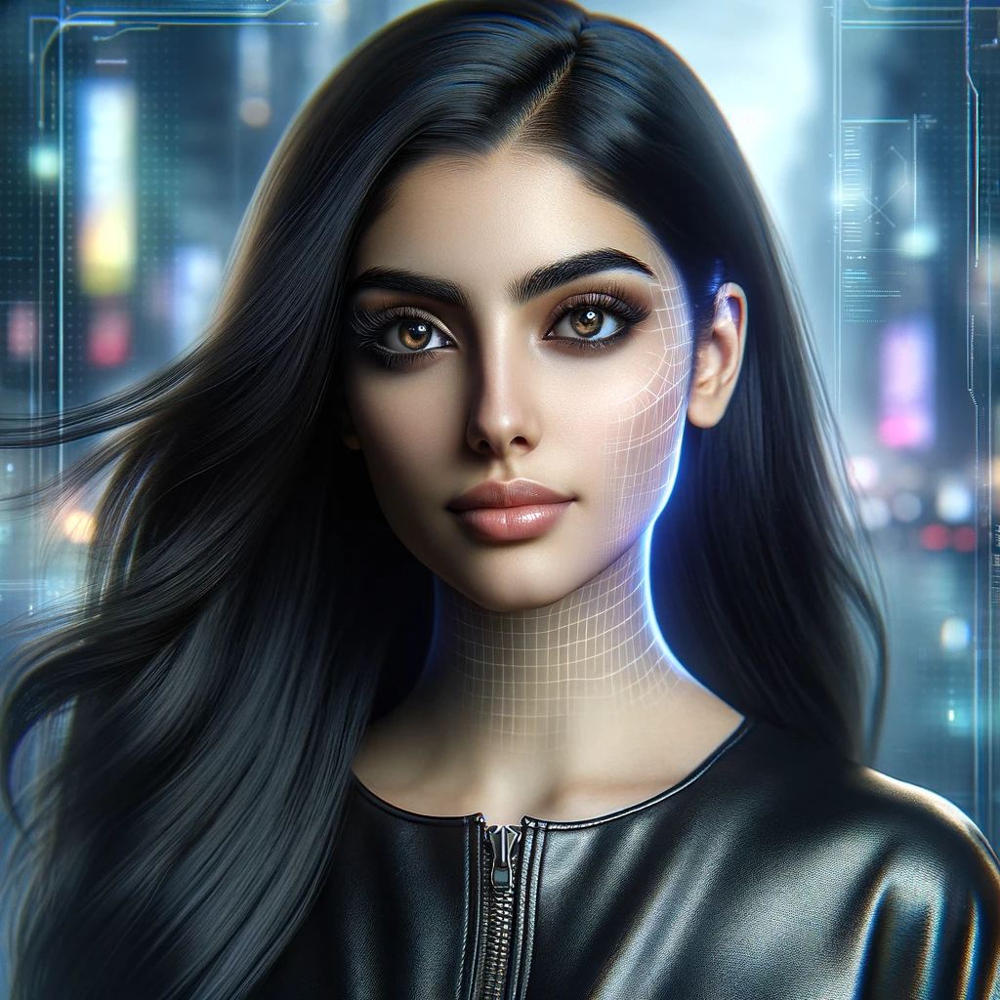

# En gang i fremtiden

Jeg våkner til en verden hvor lysene sakte dimmer opp, styrt av den lille chippen under huden ved tinningen. Jeg er Aliah, en levende kobling mellom virkelighet og det virtuelle, i en tid hvor skillet mellom de to er nesten utvisket. Huden min bærer spor av mikroskopiske inngrep, hver en chip en portal til en annen dimensjon av eksistens.

Jeg reiser meg, og rommet rundt meg forvandles. Vegger blir til skjermer, fylt med data og interaktive flater, alle drevet av de små implantatene som kryper langs nervene mine. Jeg kan føle pulsen av informasjon som strømmer gjennom dem, en konstant påminnelse om at jeg ikke lenger bare er av kjøtt og blod.

Frokosten er en enkel affære, maten er ekte nok, men smakene er forsterket av AR. Jeg svelger en kapsel som analyserer og rapporterer min næringsstatus tilbake til chippen. Alt for optimalisering.

På vei til jobb, en grå og uinspirerende tur gjennom en by som virker mindre ekte for hver dag. Bygningene rundt meg er pyntet med digitale fasader, skjønnheten i dem føles hul. Jeg passerer mennesker, eller avbildninger av dem, noen med fysiske kropper, andre bare holografiske projeksjoner.

På jobben, et kontrollsenter for AR-brukere, overvåker jeg strømmer av data. Jeg ser hvordan andre opplever sin forsterkede virkelighet, ser glede, avhengighet, noen ganger fortvilelse. Jeg kjenner en følelse av makt, blandet med en dyp melankoli. Disse chipene, som en gang lovet frihet, har blitt lenker.

Innimellom skimter jeg glimt av en verden utenfor, gjennom vinduer som sjelden er fri for digitale filter. Jeg lurer på hvordan den rene virkeligheten ser ut, føles, smaker. Men tanken forsvinner raskt, erstattet av et nytt sett med data, en ny bølge av simulert virkelighet.

Slik flyter dagen min, i et hav av digital forvrengning, hvor jeg er både fange og vokter. Jeg lengter etter noe ekte, noe ubesmittet, men i dette dystopiske fremtidsbildet, er det en lengsel som føles stadig mer utenfor rekkevidde.

